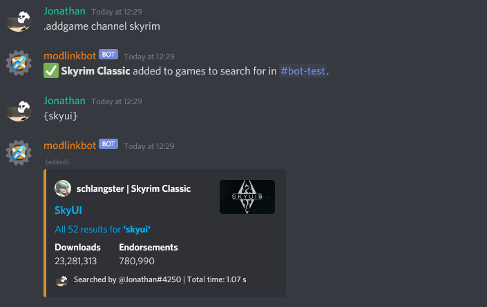
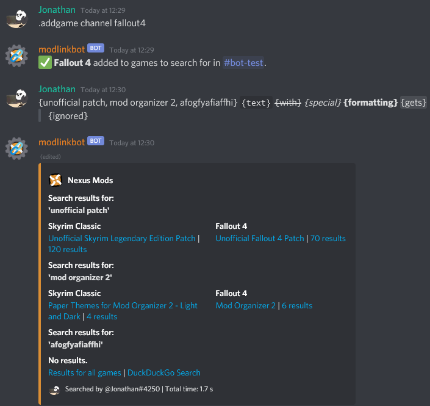

# discord-modlinkbot
[](https://top.gg/bot/665861255051083806)
[](https://discordapp.com/oauth2/authorize?client_id=665861255051083806&permissions=19649&scope=bot)
[](https://github.com/JonathanFeenstra/discord-modlinkbot/blob/master/LICENSE)
[](https://github.com/psf/black)

A [Discord](https://discord.com/) bot for linking [Nexus Mods](https://www.nexusmods.com/) search results.

## Features
Retrieve search results from [Nexus Mods](https://www.nexusmods.com/) for search queries in messages {between braces, separated by commas}, outside of any [Discord markdown](https://support.discord.com/hc/en-us/articles/210298617) or [spoiler tags](https://support.discord.com/hc/en-us/articles/360022320632), each query being between 3 and 120 characters in length. Queries cannot contain any of the following characters: ```\";:=*%$&_<>?`[]```.




This functionality is based on [u/modlinkbot on Reddit](https://www.reddit.com/r/modlinkbotsub/comments/dlp7d1/bot_operation_and_information/) and the [Nexus Mods Discord Bot](https://github.com/Nexus-Mods/discord-bot/) quicksearch command. In addition, games to search for can be configed per server or channel by using commands.

Detailed descriptions of commands and their usage are provided by using the `.help` command.
## Self-hosting
### Requirements
- [Python](https://www.python.org/downloads/) >= 3.9
- [pipenv](https://pipenv.pypa.io/en/stable/install/#installing-pipenv)

The required Python libraries can be installed with `pipenv` by using the following command in this working directory:
```
pipenv install
```
### Configuration
Create a `config.py` file in this directory. [Make a Discord bot account](https://discordpy.readthedocs.io/en/latest/discord.html) and [enable the server members intent](https://discordpy.readthedocs.io/en/latest/intents.html#privileged-intents). If you wish, you can use the [included icon image](https://raw.githubusercontent.com/JonathanFeenstra/discord-modlinkbot/master/img/icon.png) for your bot. Add the bot token to `config.py` as follows:
```python3
token = "your Discord bot token"
```
The following settings are optional:
```python3
# Set the webhook URL for logging when the bot is added or removed from a server
webhook_url = "your Discord webhook URL"

# Set a custom database path
db_path = "modlinkbot.db"

# Add the Discord user ID(s) that may use owner-only commands
owner_ids = {
    340577388331139072,  # Jonathan (developer)
    255144776695808001,  # Yoosk (host)
}

# Set the maximum number of search result messages per search
max_result_embeds = 3

# Set the maximum number of servers that the bot can join
max_guilds = 1024
```
### Launch
Run `bot.py` to start modlinkbot. The bot will stay online as long as the script is running. [Add the bot to a Discord server](https://discordpy.readthedocs.io/en/latest/discord.html#inviting-your-bot) to make use of its features.
