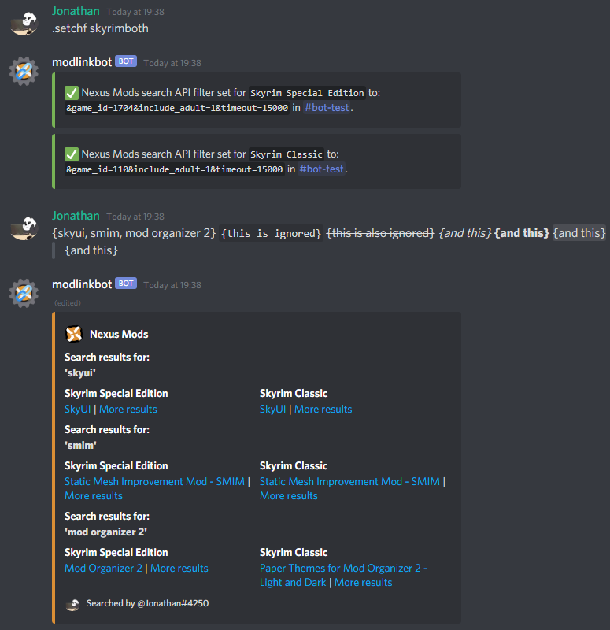

# discord-modlinkbot
A Discord bot for linking game mods. Add modlinkbot to your server using [this link](https://discordapp.com/oauth2/authorize?client_id=665861255051083806&permissions=67202209&scope=bot) (if the link does not work, this instance of the bot may no longer be available). The permissions 'Manage Server', 'Create Invite', 'Change Nickname', 'View Audit Log' and 'Manage Messages' are optional.

## Features
Retrieve search results from [Nexus Mods](https://www.nexusmods.com/) for search queries in messages {between braces, separated by commas}, outside of any [Discord markdown](https://support.discord.com/hc/en-us/articles/210298617) or [spoiler tags](https://support.discord.com/hc/en-us/articles/360022320632), each query being between 3 and 120 characters in length. Queries cannot contain any of the following characters: ```\";:=*%$&_<>?`[]```.



This functionality is based on [u/modlinkbot on Reddit](https://www.reddit.com/r/modlinkbotsub/comments/dlp7d1/bot_operation_and_information/) and the [Nexus Mods Discord Bot](https://github.com/Nexus-Mods/discord-bot/) quicksearch command. In addition, search filters are configurable per server and channel using commands.

Known bug: the [Nexus Mods search route](https://search.nexusmods.com/mods) returns outdated statistics which may lead to an incorrect first result (not the mod with the most endorsements).

Detailed descriptions of the available commands and their usage are sent by the bot when using the `.help` command.
## Self-hosting Installation
### Requirements
- [Python](https://www.python.org/downloads/) >= 3.8
- [aiohttp]() >= 3.6.2
- [aiosqlite](https://aiosqlite.omnilib.dev/en/stable/) >= 0.15.0
- [discord.py](https://github.com/Rapptz/discord.py) == 1.5.0

The required Python libraries can be installed with pip using the command:
```
pip install -r requirements.txt
```
### Configuration
Create a `config.py` file in the same directory as `bot.py`. [Make a Discord bot account](https://discordpy.readthedocs.io/en/latest/discord.html), [enable the server members intent](https://discordpy.readthedocs.io/en/latest/intents.html#privileged-intents) and add the bot token to `config.py` as follows:
```python3
TOKEN = 'your Discord bot token'
```
Add the cogs (extensions) that will be loaded on initialisation (optional):
```python3
INITIAL_COGS = (
    'cogs.admin',
    'cogs.db',
    'cogs.modsearch',
    'cogs.util',
)
```
Set the webhook URL for logging when the bot is added or removed from a guild (optional):
```python3
WEBHOOK_URL = 'your webhook URL'
```
Add the Discord user IDs that may use owner-only commands (optional):
```python3
OWNER_IDS = {
    340577388331139072,  # Jonathan (developer)
    255144776695808001,  # Yoosk (host)
}
```
Set the maximum number of search result messages per search (optional, 3 by default):
```python3
MAX_RESULT_EMBEDS = 3
```
Set the maximum number of guilds that the bot can join (optional):
```python3
MAX_GUILDS = 1024
```
### Launch
Run `bot.py` and [add the bot to the Discord server](https://discordpy.readthedocs.io/en/latest/discord.html#inviting-your-bot). The bot will only stay online as long as the script is running.
